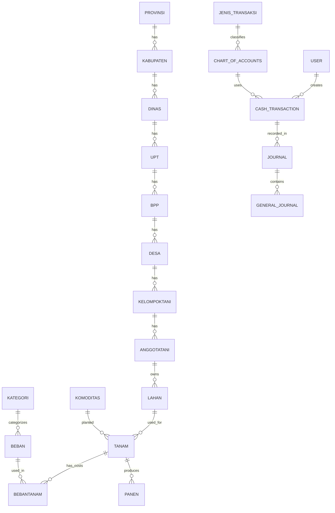

# 🌾 UsahaTani (Agricultural Cost-Benefit & Spatial Management System)

[](https://laravel.com)
[](https://www.php.net)
[](https://github.com/php-ai/php-ml)
[](https://opensource.org/licenses/MIT)

**UsahaTani** is a comprehensive agricultural enterprise management and spatial analysis platform built with the Laravel framework. It is designed to assist agricultural organizations, extension centers, and farmers in monitoring planting cycles, recording operational expenses, auditing harvests, executing financial accounting, and performing geospatial clustering analysis to assess farming efficiency and profitability.

---

## 🌟 Key Features

### 1. 🗺️ Geographic & Administrative Hierarchy
Tracks and structures farming entities across multiple administrative layers in Indonesia:
*   **Hierarchical Structure:** `Provinsi` (Province) → `Kabupaten` (Regency) → `Dinas` (Agriculture Office) → `UPT` (Technical Unit) → `BPP` (Extension Center) → `Desa` (Village).
*   **Farmer Profiling:** Manages `Kelompok Tani` (Farmer Groups), `Anggota Tani` (Farmers), and their corresponding `Lahan` (Plots of farmland).
*   **Spatial Mapping:** Leaflet-based geographic selection and visualization allowing coordinates (`latitude`, `longitude`) to be recorded for farms, groups, and offices.

### 2. 🚜 Planting & Harvest Cycles
*   **Planting Logs (`Tanam`):** Initiates crop cycles by linking specific plots of land (`Lahan`), crop types (`Komoditas`), and planting/harvest schedule estimates.
*   **Expense Auditing (`Bebantanam`):** Allows batch or individual cost-entry for labor, fertilizers, seeds, and overhead. Expenses are categorized by type (Variable vs. Fixed) and production stage (e.g., Land Prep, Fertilization, Maintenance, Harvest).
*   **Harvest Records (`Panen`):** Records harvest dates, actual yields, selling prices, and crop statuses (e.g., success, partial failure, total failure). It automatically updates profits and Revenue-to-Cost (R/C) ratios in the planting logs.

### 3. 🤖 Machine Learning Clustering (K-Means)
*   **Smart Segmentation:** Implements K-Means clustering algorithm using the `php-ai/php-ml` package to segment agricultural performance into three distinct clusters.
*   **Economic Indicators:** Clusters data based on the **R/C Ratio** (Revenue-to-Cost Ratio) to classify regions or crops into high, medium, and low-efficiency categories.
*   **Multi-Level Analysis:** Can run clustering comparisons across multiple dimensions:
    *   *Per Desa* (Villages)
    *   *Per UPT* (Technical Units)
    *   *Per Kabupaten* (Regencies)
    *   *Per Komoditas* (Commodities)
*   **Spatial Visualization:** Renders clustering groups directly onto Leaflet maps using color-coded nodes.

### 4. 🪙 Financial Accounting & Cash Flow
*   **Chart of Accounts (COA):** Structures standard financial ledgers.
*   **Double-Entry Journaling:** Records general journal entries (`Journal` & `GeneralJournal`) tracking Debits and Credits.
*   **Cash Flow Statements (`Arus Kas`):** Monitors operational cash transactions and generates real-time cash inflows and outflows summaries.

### 5. 📊 Reports & Visual Dashboards
*   **Dynamic Charts:** Visualizes crop production, revenue, and comparison of farmer group incomes using ChartJS.
*   **PDF Generation:** Exports detailed invoices, ledger lists, and financial summaries to PDF via `laravel-dompdf`.
*   **Excel Operations:** Seamlessly imports and exports farmer rosters using `phpoffice/phpspreadsheet`.

---

## 🛠️ Technology Stack

| Component | Technology / Library | Description |
| :--- | :--- | :--- |
| **Backend Framework** | Laravel 10.x | Core application MVC architecture & Eloquent ORM |
| **PHP Runtime** | PHP >= 8.1 | Backend scripting environment |
| **Machine Learning** | `php-ai/php-ml` | KMeans clustering computation |
| **Maps & GIS** | Leaflet.js | Geospatial map rendering & coordinate picking |
| **PDF Reporting** | `barryvdh/laravel-dompdf` | PDF report exporter |
| **Spreadsheets** | `phpoffice/phpspreadsheet` | Excel import/export of farmer rosters |
| **Database** | MySQL / PostgreSQL | Relational database storage |
| **Theme / CSS** | SB Admin 2 (Modified) | Responsive layout customized with an agricultural green theme |
| **Visualization** | ChartJS | Interactive charts and graphs |

---

## 📑 Glossary of Terms

Because the application is designed for Indonesian agricultural structures, the database tables use Indonesian terminology:

*   **Tanam:** Planting cycle instance.
*   **Panen:** Harvest transaction.
*   **Beban:** Expenses/Costs definitions.
*   **Bebantanam:** Active expenses logged against a specific planting cycle.
*   **Kelompok Tani (Keltani):** Local farmer groups/collectives.
*   **Anggota Tani:** Registered individual farmers.
*   **Lahan:** Agricultural plots of land.
*   **Komoditas:** Crop commodities (e.g., Rice, Corn, Shallots).
*   **BPP (Balai Penyuluhan Pertanian):** Sub-district agricultural advisory extension center.
*   **UPT (Unit Pelaksana Teknis):** Sub-district/regional agricultural technical unit.
*   **Dinas:** Regency-level governmental agriculture agency.

---

## 🗄️ Database Relationships (ERD)

Below is the database structure depicting the geographic hierarchy, operational tracking, and accounting modules.



> [!NOTE]
> Additional diagrams documenting classes, business process flows (BPMN), use-cases, and sequence diagrams can be found in the [docs/](file:///c:/laragon/data/utani/docs) directory.

---

## 🚀 Installation & Setup

Follow these steps to run the UsahaTani application locally:

### Prerequisites
Make sure you have the following installed on your machine:
*   PHP >= 8.1
*   Composer
*   Node.js & NPM
*   Database server (e.g., MySQL, MariaDB, or PostgreSQL)

### Step-by-Step Installation

1.  **Clone the Repository:**
    ```bash
    git clone https://github.com/your-username/usahatani.git
    cd usahatani
    ```

2.  **Install PHP Dependencies:**
    ```bash
    composer install
    ```

3.  **Install Front-End Dependencies:**
    ```bash
    npm install
    ```

4.  **Configure Environment Variables:**
    Copy the `.env.example` file to `.env`:
    ```bash
    cp .env.example .env
    ```
    Open the `.env` file and set your database connection:
    ```env
    DB_CONNECTION=mysql
    DB_HOST=127.0.0.1
    DB_PORT=3306
    DB_DATABASE=usahatani_db
    DB_USERNAME=your_db_username
    DB_PASSWORD=your_db_password
    ```

5.  **Generate Application Key:**
    ```bash
    php artisan key:generate
    ```

6.  **Run Database Migrations & Seeds:**
    Create the database schema:
    ```bash
    php artisan migrate
    ```
    *(Optional)* Run seeds to populate initial configuration types (if available):
    ```bash
    php artisan db:seed
    ```

7.  **Compile Assets:**
    Compile Javascript and CSS bundles:
    ```bash
    npm run dev
    ```

8.  **Run the Local Server:**
    Start Laravel's development server:
    ```bash
    php artisan serve
    ```
    Access the application in your browser at `http://127.0.0.1:8000`.

---

## 📋 Recommended System Workflow

To utilize the platform efficiently, follow this standard operations sequence:

1.  **Setup Geography & Officers:** Configure provinces, regencies, dinas offices, UPTs, and BPP centers. Register farmer groups (`Kelompok Tani`) and individual farmers (`Anggota Tani`).
2.  **Define Assets & Items:** Log cultivable plots (`Lahan`) under each farmer. Define agricultural commodities and expense standard rates (`Beban`).
3.  **Create Planting Cycle (`Tanam`):** Launch a planting cycle for a plot, selecting the commodity and expected timelines.
4.  **Manage Costs:** Log costs (`Bebantanam`) throughout the season (fertilizers, pesticides, equipment hire, seed costs).
5.  **Harvest Logging (`Panen`):** Log harvesting dates and yield weights. The system automatically computes gross revenues, net profits, and the final R/C ratio.
6.  **Analyze & Report:** Generate commodity reports or cash flow sheets, and open the Clustering panel to perform K-Means analytics on regional efficiency.

---

## 📜 License

The UsahaTani project is open-sourced software licensed under the [MIT license](https://opensource.org/licenses/MIT).
