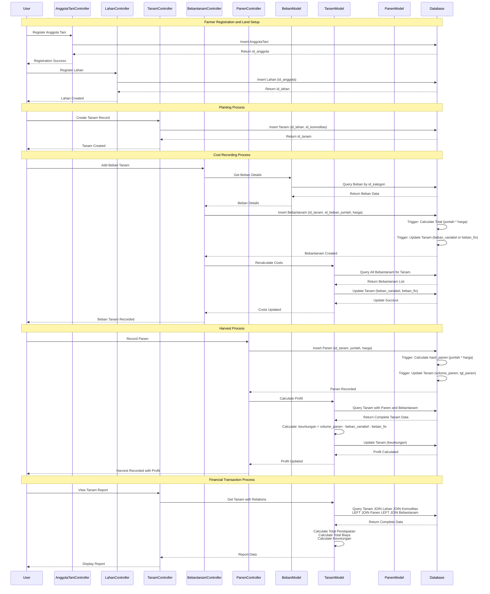

# UsahaTani System - Complete Diagrams Documentation

This document contains all Mermaid diagrams for the UsahaTani (Farming Management System).

---

## 1. Entity Relationship Diagram (ERD)

This diagram shows the complete database structure and relationships.

```mermaid
erDiagram
    %% Geographic Hierarchy
    PROVINSI ||--o{ KABUPATEN : "has"
    KABUPATEN ||--o{ DINAS : "has"
    DINAS ||--o{ UPT : "has"
    UPT ||--o{ BPP : "has"
    BPP ||--o{ DESA : "has"
    DESA ||--o{ KELOMPOKTANI : "has"
    KELOMPOKTANI ||--o{ ANGGOTATANI : "has"
    
    %% Land and Farming
    ANGGOTATANI ||--o{ LAHAN : "owns"
    LAHAN ||--o{ TANAM : "used_for"
    KOMODITAS ||--o{ TANAM : "planted"
    TANAM ||--o{ BEBANTANAM : "has_costs"
    TANAM ||--o{ PANEN : "produces"
    BEBAN ||--o{ BEBANTANAM : "used_in"
    KATEGORI ||--o{ BEBAN : "categorizes"
    
    %% Financial
    USER ||--o{ CASH_TRANSACTION : "creates"
    CHART_OF_ACCOUNTS ||--o{ CASH_TRANSACTION : "uses"
    JENIS_TRANSAKSI ||--o{ CHART_OF_ACCOUNTS : "classifies"
    CASH_TRANSACTION ||--o{ JOURNAL : "recorded_in"
    JOURNAL ||--o{ GENERAL_JOURNAL : "contains"
    
    %% Entity Definitions
    PROVINSI {
        bigint id_provinsi PK
        string kode_provinsi
        string nama_provinsi
        string latitude
        string longitude
    }
    
    KABUPATEN {
        bigint id_kabupaten PK
        string kode_kabupaten
        string nama_kabupaten
        string latitude
        string longitude
        bigint id_provinsi FK
    }
    
    DINAS {
        bigint id_dinas PK
        string kode_dinas
        string nama_dinas
        string alamat
        string latitude
        string longitude
        bigint id_kabupaten FK
    }
    
    UPT {
        bigint id_upt PK
        string kode_upt
        string nama_upt
        string alamat
        string latitude
        string longitude
        bigint id_dinas FK
    }
    
    BPP {
        bigint id_bpp PK
        string kode_bpp
        string nama_bpp
        string alamat
        string latitude
        string longitude
        bigint id_upt FK
    }
    
    DESA {
        bigint id_desa PK
        string kode_desa
        string nama_desa
        string alamat
        string latitude
        string longitude
        bigint id_bpp FK
    }
    
    KELOMPOKTANI {
        bigint id_keltani PK
        string kode_keltani
        string nama_keltani
        string alamat
        string latitude
        string longitude
        bigint id_desa FK
    }
    
    ANGGOTATANI {
        bigint id_anggota PK
        string kode_anggota
        string nama_anggota
        string nik
        string tempat_lahir
        string alamat
        string jenis_kelamin
        string no_hp
        string status_anggota
        string kategori_petani
        string latitude
        string longitude
        bigint id_keltani FK
    }
    
    LAHAN {
        bigint id_lahan PK
        string kode_lahan
        bigint id_anggota FK
        float luas
        int jml_petak
    }
    
    KOMODITAS {
        bigint id_komoditas PK
        string kode_komoditas
        string nama_komoditas
        string kategori
        int harga_satuan
    }
    
    TANAM {
        bigint id_tanam PK
        string kode_tanam
        bigint id_lahan FK
        bigint id_komoditas FK
        date tgl_tanam
        date tgl_panen
        int volume_panen
        string keuntungan
        int beban_variabel
        string beban_fix
    }
    
    KATEGORI {
        bigint id_kategori PK
        string kode_kategori
        string keterangan
    }
    
    BEBAN {
        bigint id_beban PK
        string kode_beban
        string nama_beban
        string kategori
        bigint id_kategori FK
        string jenis_produksi
        string satuan_default
    }
    
    BEBANTANAM {
        bigint id_bebantanam PK
        string kode_bebantanam
        bigint id_tanam FK
        bigint id_beban FK
        string satuan
        int jumlah
        int harga
        int total
    }
    
    PANEN {
        bigint id_panen PK
        string kode_panen
        bigint id_tanam FK
        date tgal_panen
        int jumlah
        int harga
        string hasil_panen
    }
    
    USER {
        bigint id PK
        string name
        string email
        string password
    }
    
    CHART_OF_ACCOUNTS {
        int id PK
        string kode_akun
        int id_jenis_transaksi FK
        string nama_akun
        string header
        string posisi_dr_cr
        int saldo_awal
    }
    
    JENIS_TRANSAKSI {
        int id PK
        string keterangan
    }
    
    CASH_TRANSACTION {
        int id PK
        enum transaction_type
        date transaction_date
        decimal amount
        text description
    }
    
    JOURNAL {
        bigint No PK
        string akun
        decimal debit
        decimal kredit
    }
    
    GENERAL_JOURNAL {
        int id PK
        date transaction_date
        string account_name
        decimal debit
        decimal credit
        text description
    }
```

---

## 2. Class Diagram

This diagram shows the object-oriented structure of Laravel models with their attributes and methods.

```mermaid
classDiagram
    %% Geographic Hierarchy Classes
    class Provinsi {
        +bigint id_provinsi
        +string kode_provinsi
        +string nama_provinsi
        +string latitude
        +string longitude
        +getKodeprovinsi()
    }
    
    class Kabupaten {
        +bigint id_kabupaten
        +string kode_kabupaten
        +string nama_kabupaten
        +string latitude
        +string longitude
        +bigint id_provinsi
        +getKodekabupaten()
    }
    
    class Dinas {
        +bigint id_dinas
        +string kode_dinas
        +string nama_dinas
        +string alamat
        +string latitude
        +string longitude
        +bigint id_kabupaten
        +getKodedinas()
    }
    
    class Upt {
        +bigint id_upt
        +string kode_upt
        +string nama_upt
        +string alamat
        +string latitude
        +string longitude
        +bigint id_dinas
        +getKodeupt()
    }
    
    class Bpp {
        +bigint id_bpp
        +string kode_bpp
        +string nama_bpp
        +string alamat
        +string latitude
        +string longitude
        +bigint id_upt
        +getKodebpp()
    }
    
    class Desa {
        +bigint id_desa
        +string kode_desa
        +string nama_desa
        +string alamat
        +string latitude
        +string longitude
        +bigint id_bpp
        +getKodedesa()
    }
    
    class KelompokTani {
        +bigint id_keltani
        +string kode_keltani
        +string nama_keltani
        +string alamat
        +string latitude
        +string longitude
        +bigint id_desa
        +getKodekeltani()
        +getKeltaniDetailDesa()
    }
    
    class AnggotaTani {
        +bigint id_anggota
        +string kode_anggota
        +string nama_anggota
        +string nik
        +string tempat_lahir
        +string alamat
        +string jenis_kelamin
        +string no_hp
        +string status_anggota
        +string kategori_petani
        +string latitude
        +string longitude
        +bigint id_keltani
        +getKodeanggota()
        +getAnggotaDetailkeltani()
    }
    
    %% Land and Farming Classes
    class Lahan {
        +bigint id_lahan
        +string kode_lahan
        +bigint id_anggota
        +float luas
        +int jml_petak
        +getKodelahan()
        +getLahanDetailanggota()
        +petani()
        +tanams()
    }
    
    class Komoditas {
        +bigint id_komoditas
        +string kode_komoditas
        +string nama_komoditas
        +string kategori
        +int harga_satuan
        +getKodekomoditas()
    }
    
    class Tanam {
        +bigint id_tanam
        +string kode_tanam
        +bigint id_lahan
        +bigint id_komoditas
        +date tgl_tanam
        +date tgl_panen
        +int volume_panen
        +string keuntungan
        +int beban_variabel
        +string beban_fix
        +getKodetanam()
        +getTanamDetailtotal()
        +getTanamDetaillahan()
        +getTanamDetailkomoditas()
        +lahan()
        +komoditas()
        +panens()
        +bebantanam()
        +getTotalPendapatanAttribute()
        +getTotalBiayaVariabelAttribute()
        +getTotalBiayaTetapAttribute()
        +getKeuntunganAktualAttribute()
    }
    
    class Kategori {
        +bigint id_kategori
        +string kode_kategori
        +string keterangan
    }
    
    class Beban {
        +bigint id_beban
        +string kode_beban
        +string nama_beban
        +string kategori
        +bigint id_kategori
        +string jenis_produksi
        +string satuan_default
        +getKodebeban()
        +getBebanDetailkategori()
        +normalizeJenisProduksi()
        +guessJenisProduksi()
        +resolveJenisProduksi()
        +bebantanam()
    }
    
    class Bebantanam {
        +bigint id_bebantanam
        +string kode_bebantanam
        +bigint id_tanam
        +bigint id_beban
        +string satuan
        +int jumlah
        +int harga
        +int total
        +getKodebebantanam()
        +getBebantanamDetailtanam()
        +getBebantanamDetailbeban()
        +tanam()
        +beban()
    }
    
    class Panen {
        +bigint id_panen
        +string kode_panen
        +bigint id_tanam
        +date tgal_panen
        +int jumlah
        +int harga
        +string hasil_panen
        +getKodepanen()
        +getPanenDetailtanam()
        +tanam()
    }
    
    %% Financial Classes
    class User {
        +bigint id
        +string name
        +string email
        +string password
        +remember_token
    }
    
    class ChartOfAccounts {
        +int id
        +string kode_akun
        +int id_jenis_transaksi
        +string nama_akun
        +string header
        +string posisi_dr_cr
        +int saldo_awal
    }
    
    class JenisTransaksi {
        +int id
        +string keterangan
    }
    
    class CashTransaction {
        +int id
        +enum transaction_type
        +date transaction_date
        +decimal amount
        +text description
    }
    
    class Journal {
        +bigint No
        +string akun
        +decimal debit
        +decimal kredit
    }
    
    %% Relationships
    Provinsi "1" --> "*" Kabupaten
    Kabupaten "1" --> "*" Dinas
    Dinas "1" --> "*" Upt
    Upt "1" --> "*" Bpp
    Bpp "1" --> "*" Desa
    Desa "1" --> "*" KelompokTani
    KelompokTani "1" --> "*" AnggotaTani
    AnggotaTani "1" --> "*" Lahan
    Lahan "1" --> "*" Tanam
    Komoditas "1" --> "*" Tanam
    Tanam "1" --> "*" Bebantanam
    Tanam "1" --> "*" Panen
    Beban "1" --> "*" Bebantanam
    Kategori "1" --> "*" Beban
    User "1" --> "*" CashTransaction
    ChartOfAccounts "1" --> "*" CashTransaction
    JenisTransaksi "1" --> "*" ChartOfAccounts
    CashTransaction "1" --> "*" Journal
```

---

## 3. Business Process Model and Notation (BPMN)

This diagram shows the complete business process flow from farmer registration to report generation.

```mermaid
flowchart TD
    Start([Start: Farmer Registration]) --> SetupGeo[Setup Geographic Data]
    
    SetupGeo --> CreateProvinsi[Create Provinsi]
    CreateProvinsi --> CreateKabupaten[Create Kabupaten]
    CreateKabupaten --> CreateDinas[Create Dinas]
    CreateDinas --> CreateUpt[Create UPT]
    CreateUpt --> CreateBpp[Create BPP]
    CreateBpp --> CreateDesa[Create Desa]
    CreateDesa --> CreateKelompokTani[Create Kelompok Tani]
    CreateKelompokTani --> RegisterAnggota[Register Anggota Tani]
    
    RegisterAnggota --> RegisterLahan{Register Lahan?}
    RegisterLahan -->|Yes| CreateLahan[Create Lahan Record]
    RegisterLahan -->|No| SetupKomoditas[Setup Komoditas]
    CreateLahan --> SetupKomoditas
    
    SetupKomoditas --> CreateKomoditas[Create Komoditas]
    CreateKomoditas --> SetupBeban[Setup Beban Categories]
    
    SetupBeban --> CreateKategori[Create Kategori]
    CreateKategori --> CreateBeban[Create Beban Types]
    
    CreateBeban --> StartFarming[Start Farming Process]
    
    StartFarming --> CreateTanam[Create Tanam Record]
    CreateTanam --> RecordBeban[Record Beban Tanam]
    
    RecordBeban --> SelectBeban{Select Beban Type}
    SelectBeban -->|Variable| RecordVariableBeban[Record Variable Beban]
    SelectBeban -->|Fixed| RecordFixedBeban[Record Fixed Beban]
    
    RecordVariableBeban --> CalculateTotal[Calculate Total Cost]
    RecordFixedBeban --> CalculateTotal
    
    CalculateTotal --> Maintenance{Maintenance Phase?}
    Maintenance -->|Yes| RecordBeban
    Maintenance -->|No| HarvestTime{Harvest Time?}
    
    HarvestTime -->|No| Maintenance
    HarvestTime -->|Yes| RecordPanen[Record Panen]
    
    RecordPanen --> CalculateRevenue[Calculate Revenue]
    CalculateRevenue --> CalculateProfit[Calculate Profit/Loss]
    
    CalculateProfit --> RecordFinancial[Record Financial Transaction]
    
    RecordFinancial --> CreateCashTransaction{Cash Transaction?}
    CreateCashTransaction -->|Yes| RecordCashIn[Record Cash In]
    CreateCashTransaction -->|Yes| RecordCashOut[Record Cash Out]
    CreateCashTransaction -->|No| CreateJournal[Create Journal Entry]
    
    RecordCashIn --> CreateJournal
    RecordCashOut --> CreateJournal
    
    CreateJournal --> UpdateChartOfAccounts[Update Chart of Accounts]
    UpdateChartOfAccounts --> GenerateReport[Generate Reports]
    
    GenerateReport --> EndProcess([End: Process Complete])
    
    style Start fill:#90EE90
    style EndProcess fill:#FFB6C1
    style CreateTanam fill:#87CEEB
    style RecordPanen fill:#FFD700
    style CalculateProfit fill:#FFA500
    style GenerateReport fill:#DDA0DD
```

---

## 4. Sequence Diagram

This diagram shows the interaction between components during key operations.

---

## Notes

- All diagrams are based on the actual database schema and Laravel models
- The system uses database triggers for automatic calculations
- Profit calculation: `keuntungan = volume_panen - beban_variabel - beban_fix`
- Geographic hierarchy follows Indonesian administrative structure
- All entities have auto-generated codes (e.g., AT-001, TM-001, P-001)

